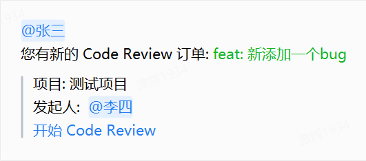
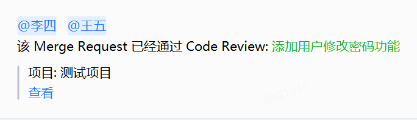

<!--
 * @Author: TanHui
 * @Date: 2021-04-08 13:26:25
 * @LastEditors: TanHui
 * @LastEditTime: 2022-10-26 14:28:52
 * @Description:
-->

# wx-gitlab-robot

让gitlab事件直接在企业微信中发起提醒，替代传统的邮件提醒，达到更好的消息送达率。


最开始做这个项目的目的是为了建立一套`Merge Requrest` 加 `Code Review`消息通知机制，整个的Merge Request机制如下：

1. 用户发起`Merge Request`,同时在`Merge Request`中的**description**去@对应用户，被@的用户会做为`Code Reviewer`来为你的代码进行`Code Review`，会在企业微信群中对被@的用户发起通知，提醒前去进行`Code Review`。通知的消息为在MR中`title`项填写的内容。
2. 当`Code Reviewer`进行`Code Review`后认为没有代码质量问题，则在`Merge Request`的评论中回复 **1** 或者 **done**,当所有`Code Reviewer`都评论过后，则认为代码质量审核通过。
3. 当`Code Review`通过后，随即发起`Merge Request`提醒合并通知，通知人为该仓库的 `author` 以及在发起`Merge Request`时 `assignee`指定的用户
4. `Merge Request`合并完成后，发起该`Merge Request`已被合并的通知，并通知发起人。


目前支持以下gitlab事件的webhook

## gitlab webhook

### 配置gitlab webhook

接口路径:  **/gitlab_hook**, 即项目部署的地址加上此路径，即为gitlab webhook Url.

Secret Token: **gitlab-webhook**, 给项目中添加webhook时，需要填写的选项，增强接口安全性, 默认为`gitlab-webhook`, 可在`src/appConfig.ts`中修改


### merge_request

提供对gitlab webhook中**merge_request**事件支持,目前支持以下类型提醒：

- 新开`Merge Request`时，提醒仓库作者和`assignee`指定的用户

  当发起MR时没有在description中指定Code Reivew人员时，通知如下

  

  当指定了Code Review人员时, 通知如下

  

- `Merge Request`发生更新时（除Title和Label更新）提醒

  

- `Merge Request`被合并时通知仓库作者和`assignee`指定的用户

  

### note

提供对`Merge Request`中发生评论时的事件提醒功能,目前支持以下类型提醒

- 当`Merge Request`中发生评论时

  

- 当`Merge Request`中对代码进行评论时

  当在Merge Request中评论1或者done且评论人为Code Review人员时，则认为代码审查通过

  

### pipeline

支持pipeline事件的提醒。当pipeline运行成功后提醒。

### 定时任务

制订了一个定时任务，用于非周末的每一天查询所有项目是否还有未处理的`Merge Request`，将向对应项目的机器人发送一条待办事项的通知

## gitlab api

### api url

本项目中使用到了gitlab的 [REST API](https://docs.gitlab.com/ee/api/),请根据您实际使用的gitlab 服务确定api地址。
配置路径： `src/appConfig.ts`

### access_token

本项目中使用到了gitlab api, 访问gitlab api需要使用[access_token](https://docs.gitlab.com/ee/user/profile/personal_access_tokens.html),
token 配置在 `src/appConfig.ts`中，请在此替换您的token。

## 企业微信机器人

上述**gitlab webhook**提醒功能依赖于企业微信机器人，由机器人负责发送消息到企业微信群，每个机器人具有唯一的`key`，请保管好群机器人`key`值，防止泄漏

[官方配置说明](https://work.weixin.qq.com/api/doc/90000/90136/91770?st=90C13105071F4D7927E5A268695641600FC9DD01795F92F5F62FA2A0DDD9C19755F98AD4C0497A68AC1D16650327A55793C300E704AB48ECA20AEF2DA0DA6B91506E059F23D0DA0E353AE3273E41F17B785B60E4D2B98F848D69F4C9D0FB6404D9E0C9580212E3A2888501AF4B94FFA52A16CF370B7420884D8F33AD9CB08CE168E72157B5FA834A2BF607B397757D5A7523098814E3F0E51DE2F25E1A828FA64F821F7B31954898737A0598E029D09D02747621D5338AB2EB6B6B90D8FCF857&vid=1688851055484810&cst=E044957B8A4BC7889EC7DEF5E4A175843D84DD7D35D0FEA2882E76C8030223CD1706148B503A6803A14356CA27219AF5&deviceid=ad7d135c-a593-4a65-b78b-ed9d8a108a66&version=3.1.8.3108&platform=win)

### 机器人key的配置

在代码中`src/config/projectKeys`文件中，维护了一份群机器人key与gitlab项目信息的映射关系,参考以下配置进行修改

```js
module.exports =module.exports = {
  //  gitlab projectName
  "project name": {
    id: "<project id>", // gitlab project id
    key: "<your robot key>" // 企业微信机器人key
  }
```


### 如何在发送消息时@企业微信用户

由于通过接口发送消息时，无法直接通过@用户名去@对应用户，想要@用户必须使用用户id。 用户ID根据每个公司的设置规则而有所不同，需要找到公司里管理企业微信后台的管理员索要用户ID设置规则。

在代码中会对gitlab事件相关的用户进行查询，以得到其中文名，然后根据用户ID规则进行一个转换以得到真实用户ID，这样才能正确的@用户。

相关代码在`src/utils/index.ts`中的 `usernameToUserid`方法，请根据不同的ID规则修改

## 关于代码评论与MR评论

这两个评论事件在 GitLab 中都是 Note 事件，通过区分事件中的属性从而判断是代码评论还是MR事件本身的评论

这是 MR 评论


这是代码评论


之所以选择使用MR评论作为 **Code Review**完成的标志，因为我的项目中使用的是gitlab 12版本，本来最开始是选用gitlab 的 approval 作为 Merge Request 的代码审批规则的，但是需要13.2版本以后才开始支持，所以只得放弃。由于采用评论作为Code Review通过与否的判断，所以需要团队间达成一个行为约定。

## 如何打包和部署

### 首次部署

1. 准备一台具有node环境的服务器
2. 在本项目中使用`yarn build` 或 `npm run build`命令打包得到 out 文件夹。
3. 将 out 文件夹下的所有文件拷贝到服务器指定的目录，然后切换到目录下，使用 `yarn` 或 `npm i`安装依赖
4. 在目录下执行命令 `pm2 start pm2.json`即可成功启动服务（默认监听端口为16080,可在pm2.json中修改）

### 版本更新

1. 进入部署服务的服务器，切换到项目所在的目录
2. 将本次打包的代码拷贝进来，覆盖老版本代码
3. 执行命令`pm2 restart webhook-server`。（webhook-server是pm2启动的项目的名字，可在pm2.json中修改）